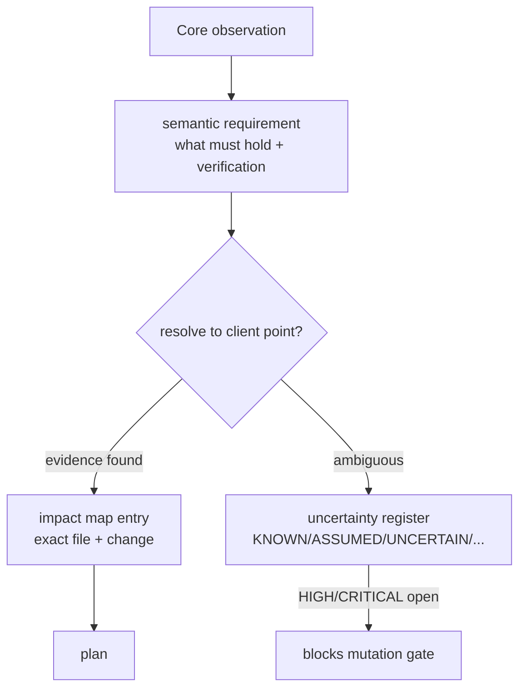

# Architecture - Core-to-client requirement mapping

The agent must never turn a Core observation into a blind client edit. Mapping happens in
two deliberate stages: **derive** (what the target Core requires, semantically) and **map**
(where that requirement is actually satisfied in this specific client).

## Stage 1 - derive semantic requirements

`derive-release-requirements` (backed by `tools/lib/inspect-core.js`) reads the target Core
and produces requirement records (`schemas/core-requirement.schema.json`) such as:

| category | example requirement | evidenceSource |
| --- | --- | --- |
| PACKAGE  | `@angular/core` must be exactly `15.2.9` | Core `package.json` |
| PACKAGE  | `rxjs` must be exactly `7.8.1` | Core `package.json` |
| CONFIG   | runtime config key `apiBaseUrl` required | Core service reading config |
| PROVIDER | `CoreHttpInterceptor` must be provided | Core module `providers` |
| ROUTE    | lazy route `admin` must be composed | Core routing module |
| ASSET    | `assets/core-config.json` required | Core asset reference |

Each requirement carries a `selectedTargetVersion` (for packages), a `verification`
predicate (how the audit later proves it), a `risk`, and a `confidence`. Requirements are
**semantic** - they say *what* must hold, not *which client file to edit*.

Requirements are **scoped**: only Core surface the client actually consumes becomes a
requirement. Core-internal build tooling (e.g. `internal-core-buildtool`) is classified
`NOT_APPLICABLE` / `CORE_ONLY` and never pushed onto the client.

## Stage 2 - map to the client implementation point

`map-core-to-client` resolves each requirement against the client inventory and semantic
graph (`tools/lib/inventory.js`) to find the *actual* place the client satisfies (or must
satisfy) it. This is where real client structure is honoured:

- **Config precedence.** A `CONFIG` requirement is resolved against the client's real
  configuration chain - build-time `environment.ts` / `environment.prod.ts` **and** any
  runtime configuration service (e.g. `app-environment.service`, `app-route.service`,
  `assets/config/*.json`). The mapping targets whichever layer the client uses, in the
  correct precedence order - not a hard-coded "edit environment.ts".
- **Provider / module registration.** A `PROVIDER` requirement resolves to the client's
  actual registration site: an `NgModule` `providers` array, a `bootstrapApplication`
  provider list (standalone), or a hybrid mix. The bootstrap style comes from the
  inventory (`NGMODULE` / `STANDALONE` / `HYBRID`).
- **Route composition.** A `ROUTE` requirement resolves to the client's real routing
  composition (root `RouterModule.forRoot`, child `forChild`, or standalone `provideRouter`),
  including lazy boundaries.
- **tsconfig inheritance.** Compiler-option requirements resolve across the client's
  multi-level `tsconfig` chain (`tsconfig.json` -> `tsconfig.app.json` -> ...), targeting
  the correct level rather than assuming a single file.

The result is a requirement map (`schemas/requirement-map.schema.json`) and an impact map:
each requirement is linked to concrete client file(s) and the exact change needed, or
flagged unresolved.

## Uncertainty, not guessing

When a requirement cannot be resolved to a client point with evidence, the mapping does
**not** invent one. It records an uncertainty (`schemas/uncertainty.schema.json`) classified
KNOWN / ASSUMED / UNCERTAIN / CONTRADICTORY / NOT_APPLICABLE. HIGH/CRITICAL open
uncertainties block the mutation gate until researched or resolved by a developer.

## Verification closes the loop

Every requirement's `verification` predicate is re-checked by
`audit-frontend-integration`: the exact version is installed, the config key is present in
the resolved layer, the provider/route is registered, the asset exists, and the production
build succeeds. A run cannot complete while any requirement is unverified or Core changed.
