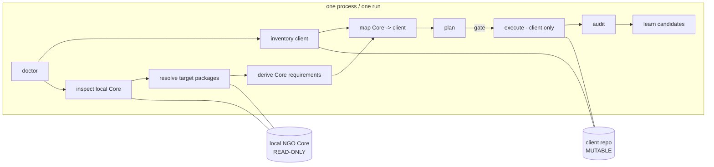

# Architecture - Local-Core, single-session front-end upgrade

## Problem

A client Angular front-end depends on `ngo-core`. When Core moves from a source version
to a target version (or a target git reference), the client must be upgraded to integrate
that exact target: the same dependency versions Core pins, the same configuration keys,
providers, routes, and assets Core now expects, and the syntax/build changes those imply.

The previous system split this across two sessions and copied `client-snapshot.md`,
`html-snapshot.md`, and `html-delta.md` files between them by hand. That is removed.

## Model

One process, one run, four inputs:

| Input | Meaning |
| --- | --- |
| `--client-path`     | Client front-end repository (the only mutable repository). |
| `--core-path`       | Local NGO Core repository (read-only source of truth). |
| `--source-version`  | The Core version the client currently integrates. |
| `--target-version` / `--target-ref` | The target Core version, or a Core git reference. |

Both repositories are inspected from the same process. The client is the only repository
written. Core is read-only and is fingerprinted before and after inspection.

## Repository roles and isolation

- **Core is never written and never switched.** If `--target-ref` differs from the Core
  checkout, a disposable `git worktree` is created under
  `runs/<client>/<run-id>/research/core-target/` (outside both repositories). The
  developer's Core working tree, branch, and index are untouched.
- **Core fingerprint.** `tools/lib/inspect-core.js` records Core's git identity (HEAD,
  status, ref) plus content hashes of key files before and after inspection. Every skill
  that reads Core reports `coreUnchanged`; `execute` and `audit` fail closed if Core
  changed (`BLOCKED_CORE_MODIFIED`).
- **Client safety.** Before any mutation, `execute-frontend-upgrade` records a rollback
  checkpoint. The mutation gate (`tools/lib/engine.js -> mutationGate`) refuses to proceed
  without it.

## Pipeline stages

1. **validate-local-repositories** - both paths exist, are the right repositories, source
   version agrees, paths are distinct and non-nested; emits a doctor report.
2. **inventory-client-frontend** - workspace type (NGMODULE / STANDALONE / HYBRID),
   bootstrap style, file inventory, semantic graph, and role coverage.
3. **inspect-local-core** - read-only Core inventory + semantic graph + integration
   requirements, scoped to what the client actually consumes; records Core fingerprint.
4. **resolve-target-packages** - exact target versions from Core's manifests (no ranges);
   classifies every package (CORE_ALIGNED / PEER / CLIENT_ONLY / NOT_APPLICABLE / ...).
5. **derive-release-requirements** - normalise Core findings into semantic requirements
   ("provider X required", "config key Y required", "route Z required").
6. **map-core-to-client** - resolve each requirement to the client's real implementation
   point (config precedence, module/provider registration, route composition, tsconfig
   inheritance); unresolved points raise uncertainty.
7. **plan-frontend-upgrade** - a complete read-only plan with exact files and evidence;
   vague actions are rejected; produces the uncertainty register.
8. **execute-frontend-upgrade** - client-only mutation behind the gate, with checkpoints.
9. **investigate-frontend-failure** - classify build/integration failures, apply bounded
   fixes, or trigger replanning; bounded retries then escalate.
10. **audit-frontend-integration** - mandatory: exact versions installed, production build
    green, required config/providers/routes present, Core unchanged.
11. **learn-from-frontend-run** - redacted learning candidates only (never auto-approved).

`developer-escalation` is reachable from every stage and always emits a resume command.

## State and durability

Every run persists under `runs/<client>/<run-id>/`: `state.json` (schema
`schemas/run-state.schema.json`), decisions/actions logs, checkpoints, evidence, and
artifacts (inventories, semantic graphs, package manifest, requirement/impact maps, plan,
uncertainty register, audit report). `resume` reads `state.json.nextAction` and continues,
re-verifying that Core and planning fingerprints still match.

## Why this is safe by construction

- The only write path touches the client repository.
- Target versions are copied from Core manifests, so the client cannot drift onto
  unpinned or newer-than-Core dependencies.
- Mutation cannot begin without a READY plan, a client checkpoint, a Core fingerprint,
  and no open HIGH/CRITICAL uncertainty.
- Completion cannot be claimed without a passing integration audit.
