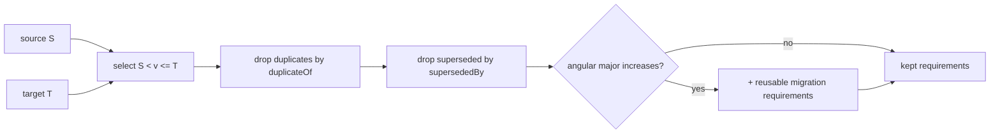

# Architecture - Release knowledge

The agent never loads the raw release notes at runtime. Instead, the notes are imported
once into **canonical, structured, atomic requirements**, and only the small subset that
applies to a given upgrade range and a given client is ever considered.

## Layers (canonical wins; markdown is derived)

```
knowledge/
  canonical/
    releases/<version>/{release,frontend,backend,database,deployment,decisions}.yaml
    migrations/angular-10-to-15.yaml          # reusable framework migration
    appsettings/backend-appsettings.yaml      # backend configuration requirements
    versions/version-manifest.json            # ngo-core <-> Angular/TS/ES mapping
  derived/*.md                                # human-readable, generated/validated from canonical
  raw/release-note-import/                    # sanitized import material - NEVER read at runtime
  index/                                      # optional lookup indexes
  candidates/                                 # unapproved learning candidates
```

Precedence is defined in [config/knowledge-priority.yaml](../../config/knowledge-priority.yaml):
the **local target Core repository** and the **installed target packages** outrank every
written note; canonical structured requirements outrank derived markdown; raw notes are
import material only.

## Atomic requirement

Every requirement (`schemas/release-requirement.schema.json`) is atomic and testable and
carries: stable `id`, `releaseVersion`, `scope`, `category`, `timing`, `applicability`,
`semanticRoles`, `sourceEvidence`, optional `corePaths` and `clientDiscovery`, `action`,
`automation`, `validation`, `risk`, `confidence`, `status`, and duplicate/supersession
relationships (`duplicateOf`, `supersedes`, `supersededBy`).

- **Scope**: FRONTEND / BACKEND / DATABASE / SHAREPOINT / PIPELINE / AZURE / DEPLOYMENT / CROSS_CUTTING.
- **Timing**: BEFORE_UPGRADE / DURING_UPGRADE / BEFORE_DEPLOYMENT / AFTER_DEPLOYMENT / MANUAL_REVIEW.
- **Applicability**: ALWAYS / IF_FILE_EXISTS / IF_SYMBOL_USED / IF_PACKAGE_USED / IF_FEATURE_ENABLED /
  IF_CLIENT_CUSTOMIZED / IF_CONFIGURATION_EXISTS / IF_DATABASE_DATA_MATCHES / IF_PM_APPROVES /
  IF_DEPLOYMENT_ENVIRONMENT_USES.
- **Automation**: AUTO_SAFE / AUTO_AFTER_MAPPING / MANUAL_DECISION / MANUAL_EXECUTION / REPORT_ONLY.

## Release range resolution

`tools/lib/release-range.js` selects requirements where `sourceVersion < releaseVersion <=
targetVersion`, then:

- **Deduplicates backports**: a `status: DUPLICATE` record whose `duplicateOf` primary is
  also in range is dropped (e.g. the 9.1.0 re-list of the 8.6.0 mark-as-paid card).
- **Applies supersession**: a record whose `supersededBy` is in range is dropped in favour
  of the superseding record (e.g. 8.2.0 supersedes the 7.6.0 AzureAdId tool ownership).
- **Triggers reusable migrations**: the Angular 10 -> 15 migration loads when the client's
  Angular major increases across the range (source major <= 14, target major >= 11,
  increasing) - derived from each release manifest's `frameworkTransition`.

Duplicates and supersession are **evidence-driven** - the resolver never infers them
without an explicit record.



## Keeping prompts small

`tools/lib/knowledge-context.js` builds a minimal packet per decision: the release range,
applicable requirement IDs, the current requirement, the relevant Core/client evidence,
applicable policy, known failed patterns, uncertainty, and the output schema. Full raw
notes and evidence stay on disk under `runs/`, never in the model context.

## Importing and updating

See [../operations/import-release-notes.md](../operations/import-release-notes.md) and
[../operations/update-release-knowledge.md](../operations/update-release-knowledge.md).
