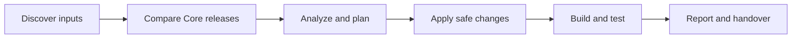

# NGO Core Upgrade

Upgrade a client's **NGO.Core backend packages and Angular frontend** through
GitHub Copilot. One request, a checked plan, and one combined report.

## 🚀 Quick Start

1. **Open the workspace.** Open this folder and your client repository in the
   same VS Code window. Use [ngo-core-upgrade.code-workspace](ngo-core-upgrade.code-workspace)
   as a template.
2. **Choose the agent.** Open Copilot Chat and select **ngo-core-upgrade**.
3. **Send your request:**

   ```text
   Upgrade this repository from Core 9.2 to 9.3.
   ```

The agent discovers local inputs and asks for missing or conflicting information.
Keep a local NGO Core checkout available for read-only comparison. Release notes
are optional; the requested target version must be explicit.

> You do not need to learn the internal agents, skills, schemas, or commands.

## ✅ What You Need

| Requirement | Purpose |
| --- | --- |
| VS Code with GitHub Copilot access | Run the custom agent |
| Git and Node.js 14+ | Run the upgrade framework |
| Client repository and local NGO Core checkout | Compare and apply the upgrade |
| Appropriate .NET SDK / frontend toolchain | Build and test the selected track |

For frontend upgrades, Node must also match the client's Angular version.
The agent checks required tools before execution.

## 💬 Example Requests

| Goal | Request |
| --- | --- |
| Both tracks | `Upgrade this client from Core 9.2 to 9.3.` |
| Backend only | `Upgrade only the backend NGO.Core packages to 9.3.` |
| Frontend only | `Align only the frontend with Core 9.3.` |
| Resume | `Resume the upgrade for <client> using its saved run state.` |
| Check releases | `Check for newer Core releases in <Core path>.` |

The backend and frontend agents remain available for standalone work. For normal
use, start with **ngo-core-upgrade** and state which track you need.

## ⚙️ What Happens



Shared Core facts are cached and reused when their source commits, notes, and
analyzer version match. Each track keeps its own plan, evidence, and validation.
Unexpected failures enter bounded diagnosis; unresolved risks are escalated.

## 🛡️ Safety

- **Plan before mutation:** client changes require a ready plan and safety checks.
- **Core stays read-only:** no edits or branch switching in the Core checkout.
- **Validate before completion:** builds, tests, coverage, and evidence gates remain.
- **Keep human approval where needed:** destructive changes, ambiguity, conflicts,
  and required approvals stop automatic execution.
- **Protect knowledge and secrets:** candidates are not automatically canonical;
  secret values belong in the secret provider.

The agent continues safe work automatically. A blocked run reports why it stopped
and the exact next action; it does not silently claim success.

## 📋 Where Results Go

| Output | Location |
| --- | --- |
| Combined report and deployment handover | `orchestrator/runs/<client>/<run-id>/` |
| Backend state, checkpoints, and evidence | `backend/runs/<client>/<run-id>/` |
| Frontend state, checkpoints, and evidence | `frontend/runs/<client>/<run-id>/` |
| Reusable Core candidate facts | `ingest/knowledge/candidates/releases/` |

The final response links to the relevant plan, report, and saved state. Run data
is local to the machine that performed the upgrade; keep it when handing off or
resuming work.

## 📦 Install on Another Machine

Open a clone of this repository to use its workspace customizations. To register
the agents and skills for use from other workspaces, run the installer:

**Windows**

```powershell
.\install.ps1 -RepoUrl https://github.com/NamDinh0403/NGO-Core-Upgrade.git
```

**macOS / Linux**

```bash
bash install.sh --repo https://github.com/NamDinh0403/NGO-Core-Upgrade.git
```

For an existing copy on Windows:

```powershell
.\install.ps1 -InstallDir "D:\tools\NGO Core Upgrade" -SkillsOnly
```

If your system blocks PowerShell scripts, follow your organization's approved
execution policy. For portable packaging, updates, and removal, see [IMPORT.md](IMPORT.md).

## 📚 Developer Reference

You only need these when maintaining or troubleshooting the framework.

| Area | Documentation |
| --- | --- |
| Routing and safety contract | [AGENTS.md](AGENTS.md) |
| Shared release ingestion | [ingest/README.md](ingest/README.md) |
| Shared-run coordination | [orchestrator/README.md](orchestrator/README.md) |
| Backend workflow | [backend/README.md](backend/README.md) |
| Frontend workflow | [frontend/README.md](frontend/README.md) |
| Optimization results | [docs/refactor/optimization-report.md](docs/refactor/optimization-report.md) |

<a id="tests--validation"></a>

## 🧪 Tests & Validation

Run from this repository's root:

```powershell
node tools/validate-all.js
```

This runs all **14 framework suites** and checks that tests did not modify tracked
files. Add `--verbose` for individual suite output. Framework tests are not a
substitute for a real client's build, tests, or deployment verification.

<details>
<summary>Individual suites for troubleshooting</summary>

Run each group from its module folder.

```text
# ingest/
node tools/ingest.test.js

# orchestrator/
node tests/orchestrator.test.js

# backend/
node tools/validate.js
node tools/repo-layout.test.js
node tools/skills.test.js
node tools/release-knowledge.test.js
node tools/bootstrap/tests/bootstrap.test.js
node tools/run-evals.js

# frontend/
node tools/validate.js
node tools/repo-layout.test.js
node tools/skills.test.js
node tests/release-schema.test.js
node tests/release-knowledge.test.js
node tools/run-evals.js
```

Backend release-knowledge tests report local run gaps as warnings. Add
`--include-runs` when deliberately auditing those runs.

</details>
